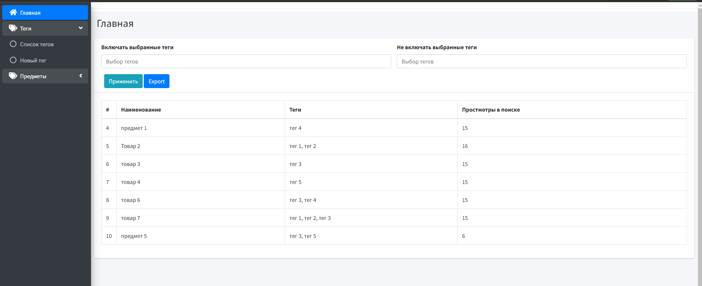

Тестовое задание на Laravel 
======================

### При развороте:

1. `cp .env.example .env`
2. указать настроки подключения к БД для механизма миграций в файле .env

### Параметры сервера:
*  PHP 7.4
*  mysql 5.7

### сборка:
*  `composer install`

### Сборка через Docker sail

1. `cp .env.example .env`
2. `./vendor/bin/sail up` - Запуск приложения
3. `./vendor/bin/sail stop` - Остановить приложения
#### Примечание
* При развороте проекта в контейнере избегать пробелов по пути к проекту

### Управление

* `php artisan serve` - Запуск приложения
* `php artisan migrate` - Применить миграции
